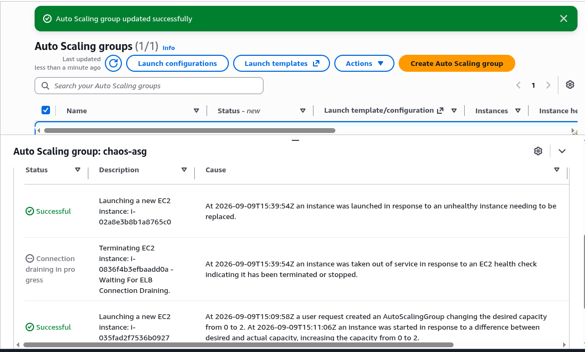
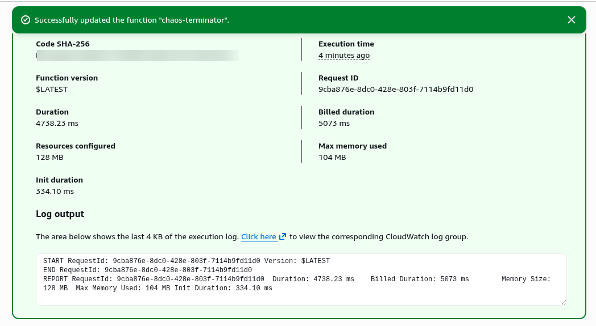
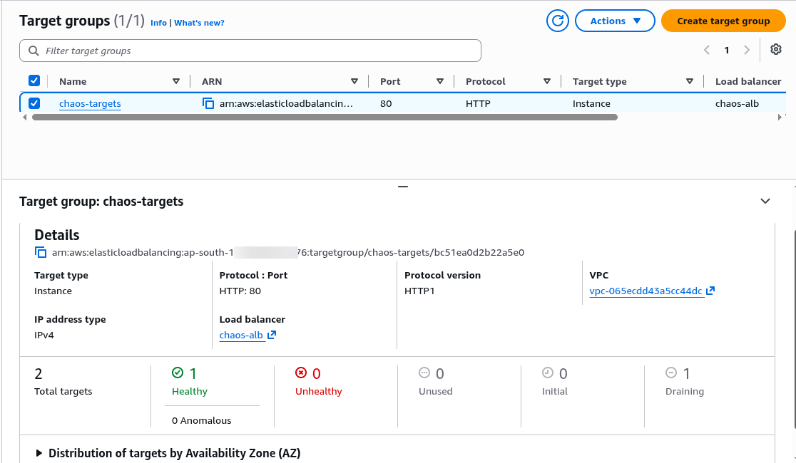
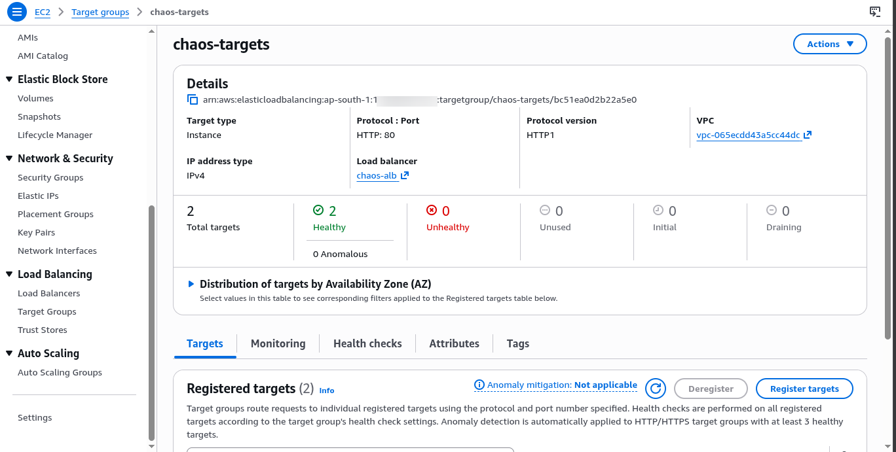

# 01 - Chaos Engineering Web App

> **AWS Services:** EC2 · ALB · Auto Scaling Group · Lambda · CloudWatch · CloudFormation

---

## What I Built

A fault-tolerant web app running on 2 EC2 instances behind an Application Load Balancer.
A Lambda function randomly terminates one EC2 instance. The Auto Scaling Group detects
the failure and automatically launches a replacement. Recovery measured and proved with screenshots.

---

## Architecture

```
              Internet
                 |
    ┌────────────▼────────────┐
    │  Application Load       │
    │  Balancer (ALB)         │  <- single entry point, distributes traffic
    └────────┬────────┬───────┘
             │        │
    ┌────────▼─┐  ┌───▼──────┐
    │ EC2 #1   │  │ EC2 #2   │  <- both run the same Python web app
    │ (AZ-1)   │  │ (AZ-2)   │  <- in different Availability Zones
    └──────────┘  └──────────┘
         └────────────┘
              Auto Scaling Group
              min: 2 | desired: 2 | max: 4

    ┌─────────────────────────┐
    │  Lambda: chaos-         │  <- manually triggered
    │  terminator             │  <- picks a random EC2 and kills it
    └─────────────────────────┘
              │
              ▼
    ASG detects unhealthy instance
              │
              ▼
    ASG launches replacement EC2
    (recovery time: ~60-90 seconds)
```

---

## Services Used - Why Each One

| Service | Why it's here |
|---------|--------------|
| EC2 (t3.micro) | Runs the web application |
| ALB | Distributes traffic across instances - single URL for users |
| Target Group | ALB checks `/health` every 10s - removes unhealthy instances |
| Auto Scaling Group | Monitors instance count - replaces terminated instances automatically |
| Launch Template | Blueprint for new EC2s - AMI, instance type, startup script |
| Lambda | Chaos agent - terminates a random instance to test recovery |
| IAM Role | Grants Lambda permission to terminate EC2 and read ASG state |
| CloudWatch | Shows ASG activity, instance health history |
| CloudFormation | Deploys all resources via code - reproducible infrastructure |

---

## Screenshots

### ASG Activity - instance terminated, replacement launching


### Lambda execution - chaos triggered successfully


### Target group - instance draining after termination


### Browser - original instance serving before chaos


### Browser - new instance serving after ASG recovery


### Target group - both instances healthy again


---

## How to Deploy

### Step 1 - Manual (Console) - Learn by doing

1. **Security Groups** -> EC2 -> Security Groups -> Create
   - `chaos-alb-sg`: inbound port 80 from `0.0.0.0/0`
   - `chaos-ec2-sg`: inbound port 80 from `chaos-alb-sg` only

2. **Launch Template** -> EC2 -> Launch Templates -> Create
   - AMI: Amazon Linux 2023
   - Instance type: t3.micro
   - Security group: `chaos-ec2-sg`
   - User data: paste contents of `app/app.py` wrapped in startup script

3. **Target Group** -> EC2 -> Target Groups -> Create
   - Protocol: HTTP, Port: 80
   - Health check path: `/health`
   - Health check interval: 10 seconds

4. **Application Load Balancer** -> EC2 -> Load Balancers -> Create
   - Type: Application
   - Scheme: internet-facing
   - Subnets: select 2 subnets in different AZs
   - Security group: `chaos-alb-sg`
   - Listener: port 80 -> forward to target group

5. **Auto Scaling Group** -> EC2 -> Auto Scaling Groups -> Create
   - Launch template: select `chaos-launch-template`
   - Min: 2, Desired: 2, Max: 4
   - Attach to target group created above
   - Health check type: ELB

6. **IAM Role for Lambda** -> IAM -> Roles -> Create Role
   - Trusted entity: Lambda
   - Attach policy: `AWSLambdaBasicExecutionRole`
   - Add inline policy: allow `ec2:TerminateInstances` and `autoscaling:DescribeAutoScalingGroups` on `*`
   - Name it: `lambda-chaos-role`

7. **Lambda Function** -> Lambda -> Create Function
   - Runtime: Python 3.12
   - Execution role: select `lambda-chaos-role`
   - Paste code from `cloudformation/template.yaml` (ChaosLambda section)
   - Environment variable: `ASG_NAME = chaos-asg`
   - Timeout: 30 seconds

### Step 2 - Test Chaos

1. Open ALB DNS URL in browser - note instance ID
2. Refresh several times - ALB routes you across instances
3. Go to Lambda -> Test -> trigger `chaos-terminator`
4. Go to EC2 console -> watch one instance terminate
5. Watch ASG Activity History -> new instance launching
6. Wait ~90 seconds -> refresh browser -> app is back
7. Go to CloudWatch -> EC2 -> Auto Scaling -> see group size dip and recover

### Step 3 - Via CloudFormation (cross-check)

```bash
# Deploy
aws cloudformation create-stack \
  --stack-name chaos-engineering \
  --template-body file://cloudformation/template.yaml \
  --parameters \
    ParameterKey=VpcId,ParameterValue=<your-vpc-id> \
    ParameterKey=SubnetIds,ParameterValue='<subnet-1>,<subnet-2>' \
  --capabilities CAPABILITY_NAMED_IAM

# Delete everything when done
aws cloudformation delete-stack --stack-name chaos-engineering
```

---

## Key Concepts Demonstrated

- **ALB Target Group health checks** - `/health` endpoint removes unhealthy instances from rotation
- **ASG self-healing** - detects ELB health check failure, automatically replaces instance
- **Multi-AZ deployment** - instances in different AZs survive AZ-level failures
- **Launch Template** - ensures every new EC2 starts with identical configuration
- **Security group chaining** - EC2 only accepts traffic from ALB, not from internet directly
- **IAM least privilege** - Lambda only has the two permissions it actually needs

---

## Alternatives & Tradeoffs

| What we used | Production alternative | Why you'd upgrade |
|-------------|----------------------|-------------------|
| On-demand EC2 | Reserved Instances | Up to 72% cheaper for predictable workloads |
| Single ALB | ALB + WAF | Add DDoS protection and rate limiting |
| t3.micro | t3.small / t3.medium | More CPU/memory for real apps |
| Manual chaos Lambda | AWS Fault Injection Simulator (FIS) | Enterprise chaos engineering with scenarios |
| 2 AZs | 3 AZs | Higher availability - survives 2 simultaneous AZ failures |
| HTTP only | HTTPS with ACM | Production apps must use TLS - free via ACM |
