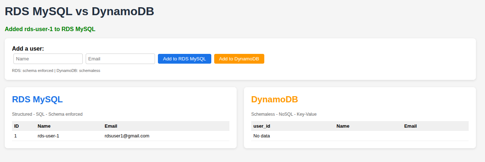
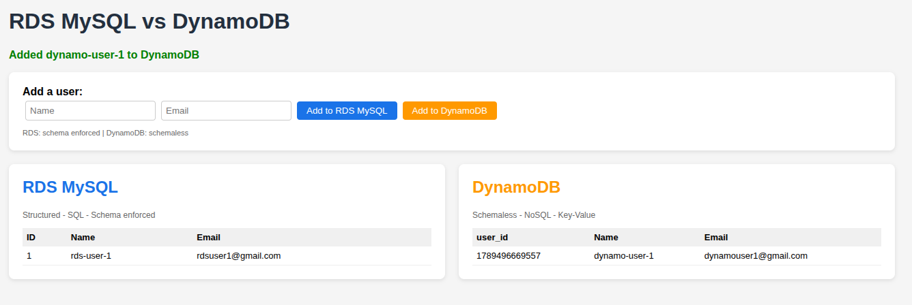
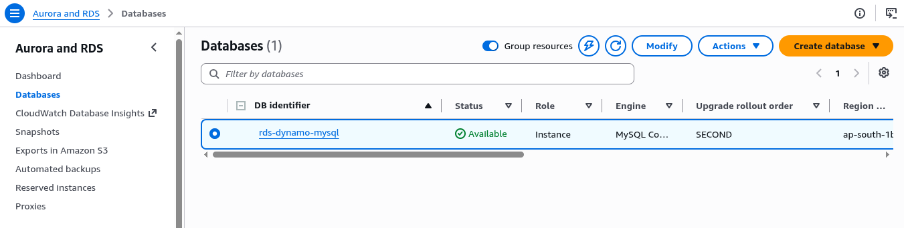
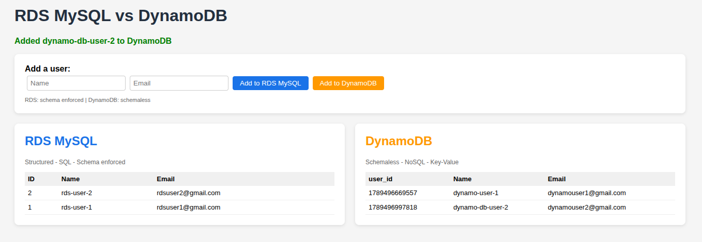
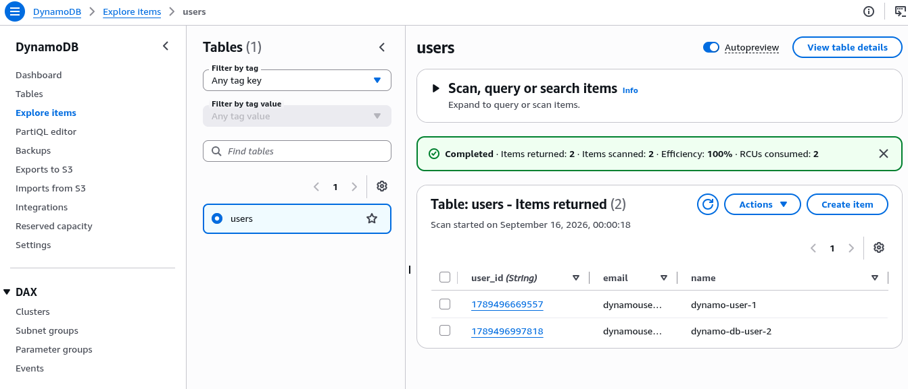

# 02 - RDS MySQL vs DynamoDB

> **AWS Services:** EC2 · RDS MySQL · DynamoDB · IAM · VPC Security Groups · CloudFormation

---

## What I Built

A Python web app running on EC2 that writes to both RDS MySQL and DynamoDB at the same time.
Same operation (add a user) hits two completely different database engines - one relational, one NoSQL.
Shows the core tradeoff between SQL schema enforcement and DynamoDB's schemaless flexibility.

---

## Architecture

```
          Internet
              |
     ┌────────▼────────┐
     │   EC2 (port 80) │  <- Python HTTP app, no framework
     │   app.py        │
     └────┬────────┬───┘
          │        │
     ┌────▼──┐  ┌──▼──────────┐
     │  RDS  │  │  DynamoDB   │  <- no VPC, managed service
     │ MySQL │  │  users table│
     │ (VPC) │  └─────────────┘
     └───────┘
          ^
          Security group chaining:
          EC2-SG -> RDS-SG (port 3306 only)

     IAM Role on EC2 -> DynamoDB access (no keys in code)
```

---

## Key Difference This Project Shows

| | RDS MySQL | DynamoDB |
|---|---|---|
| Type | Relational SQL | NoSQL Key-Value |
| Schema | Enforced (columns must exist) | Schemaless (any fields) |
| Access | username + password | IAM Role (no credentials) |
| Location | Inside VPC, needs subnet group | Outside VPC, managed |
| Scaling | Vertical (bigger instance) | Horizontal (auto) |
| Free tier | db.t3.micro, 20GB | 25GB + 25 RCU/WCU |

---

## Screenshots

### App - user added to RDS MySQL


### App - user added to DynamoDB


### AWS Console - RDS database available


### App - both tables populated with multiple users


### AWS Console - DynamoDB items in users table


---

## How to Deploy

### Step 1 - Manual (Console)

1. **Security Groups** -> EC2 -> Security Groups -> Create
   - `rds-dynamo-ec2-sg`: inbound port 80 from `0.0.0.0/0`, outbound All traffic
   - `rds-dynamo-rds-sg`: inbound port 3306 from `rds-dynamo-ec2-sg` only

2. **RDS Subnet Group** -> RDS -> Subnet groups -> Create
   - Select at least 2 subnets in different AZs

3. **RDS MySQL** -> RDS -> Create database
   - Engine: MySQL 8.0
   - Template: Free tier (db.t3.micro)
   - DB name: `usersdb`, Username: `admin`
   - Attach subnet group and `rds-dynamo-rds-sg`
   - Public access: No

4. **DynamoDB Table** -> DynamoDB -> Create table
   - Table name: `users`
   - Partition key: `user_id` (String)
   - Capacity: On-demand

5. **IAM Role for EC2** -> IAM -> Roles -> Create
   - Trusted entity: EC2
   - Inline policy: `dynamodb:PutItem`, `dynamodb:Scan`, `dynamodb:GetItem` on the users table ARN
   - Name: `rds-dynamo-ec2-role`

6. **EC2 Instance** -> EC2 -> Launch Instance
   - AMI: Amazon Linux 2023
   - Instance type: t3.micro
   - IAM instance profile: `rds-dynamo-ec2-role`
   - Security group: `rds-dynamo-ec2-sg`
   - User data: paste contents of `userdata.sh` (update RDS_HOST and RDS_PASSWORD first)

### Step 2 - Via CloudFormation (cross-check)

```bash
# Deploy
aws cloudformation create-stack \
  --stack-name rds-vs-dynamodb \
  --template-body file://cloudformation/template.yaml \
  --parameters \
    ParameterKey=VpcId,ParameterValue=<your-vpc-id> \
    ParameterKey=SubnetIds,ParameterValue='<subnet-1>,<subnet-2>' \
    ParameterKey=PublicSubnetId,ParameterValue=<subnet-1> \
    ParameterKey=DBPassword,ParameterValue=<your-password> \
  --capabilities CAPABILITY_NAMED_IAM

# Delete everything when done
aws cloudformation delete-stack --stack-name rds-vs-dynamodb
```

---

## Key Concepts Demonstrated

- **Security group chaining** - RDS only accepts port 3306 from EC2 security group, not from internet
- **RDS needs a subnet group** - must span 2+ AZs, unlike DynamoDB which lives outside VPC
- **IAM Role for DynamoDB access** - EC2 gets credentials from instance metadata, no keys in code
- **SQL schema enforcement** - RDS requires `CREATE TABLE` first, DynamoDB accepts any item shape
- **Free tier limits** - RDS db.t3.micro 750 hrs/month, DynamoDB 25GB + read/write capacity free

---

## Alternatives & Tradeoffs

| What we used | Production alternative | Why you'd upgrade |
|---|---|---|
| RDS MySQL single AZ | RDS Multi-AZ | Automatic failover, no downtime on AZ failure |
| DynamoDB on-demand | DynamoDB provisioned | Predictable cost for steady traffic |
| Password in UserData | AWS Secrets Manager | Rotate credentials without redeploying EC2 |
| EC2 direct | RDS Proxy + EC2 | Connection pooling - RDS handles fewer open connections |
| t3.micro | Aurora Serverless | Auto-scales, pay per query, MySQL compatible |
