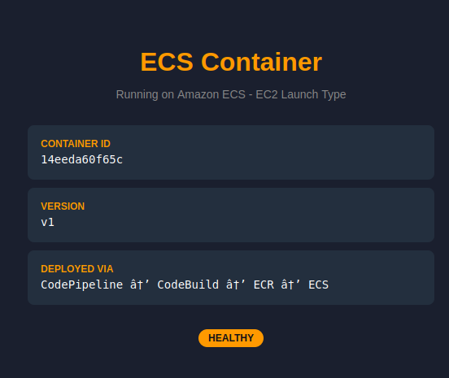
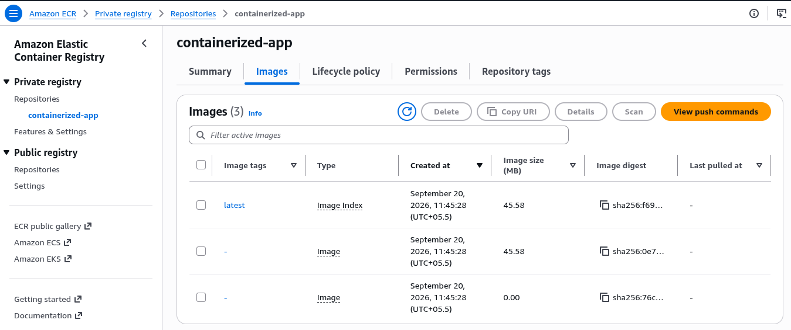
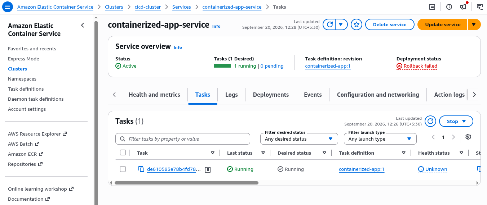
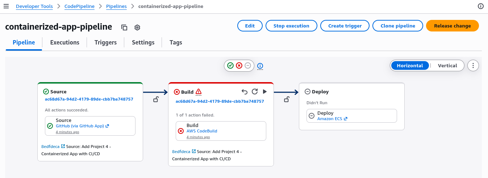
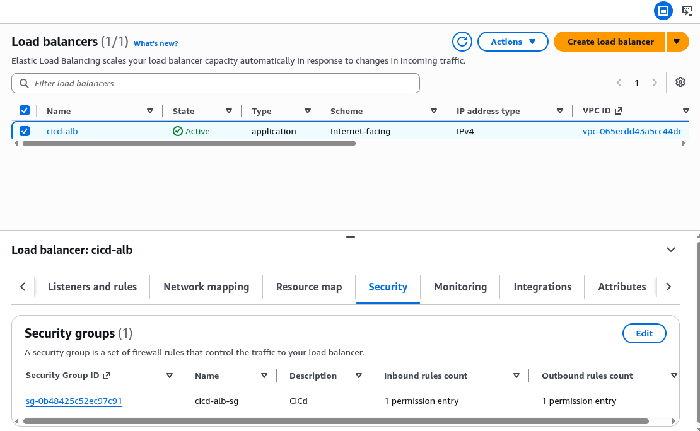

# Project 4 - Containerized App with CI/CD (ECS + ECR + CodePipeline)

## What This Project Does

Deploys a Dockerized Python web app to Amazon ECS (EC2 launch type) with an Application Load Balancer in front. A CodePipeline connects GitHub to ECS so that pushing code triggers a build and deploy automatically.

The app shows which container is running, the version, and how it was deployed - useful for verifying that new deployments roll out correctly.

---

## Architecture

```
Internet
    |
    | HTTP port 80
    v
Application Load Balancer (cicd-alb)
    |   Security Group: cicd-alb-sg (allows 0.0.0.0/0 on port 80)
    |
    | forwards to port 80
    v
ECS Service (containerized-app-service)
    |   EC2 Launch Type - t3.micro
    |   Security Group: cicd-ecs-sg (allows all traffic from cicd-alb-sg only)
    |   Task Definition: containerized-app:1
    |
    | pulls image
    v
ECR Repository (containerized-app)
    |   Private Docker registry
    |   Image: containerized-app:latest
    |
    ^ push image
    |
CodePipeline (containerized-app-pipeline)
    |
    |-- Source: GitHub (aws-projects repo, main branch)
    |-- Build:  CodeBuild (builds Docker image, pushes to ECR)
    |-- Deploy: ECS (updates service with new image)
```

---

## Key AWS Services Used

| Service | Purpose |
|---------|---------|
| ECR | Private Docker image registry |
| ECS (EC2) | Runs containers on an EC2 instance managed by ECS agent |
| ALB | Distributes traffic to ECS tasks, handles health checks |
| CodePipeline | Orchestrates the CI/CD flow: Source → Build → Deploy |
| CodeBuild | Builds Docker image and pushes to ECR |
| IAM | Task execution role (pull from ECR), instance role (ECS agent), build/pipeline roles |

---

## Screenshots

<p align="center">
  <br/>
  <em>App running in browser - container ID, version, HEALTHY</em>
</p>

<p align="center">
  <br/>
  <em>ECR repository with pushed Docker images</em>
</p>

<p align="center">
  <br/>
  <em>ECS service with 1 task running</em>
</p>

<p align="center">
  <br/>
  <em>CodePipeline - Source succeeded, Build failed (AWS account limit on new accounts)</em>
</p>

<p align="center">
  <br/>
  <em>ALB active with security group</em>
</p>

---

## How It Was Built

### Step 1 - ECR Repository

Created private ECR repo named `containerized-app`.

### Step 2 - Build and Push Docker Image

```bash
# login to ECR
aws ecr get-login-password --region ap-south-1 | \
  docker login --username AWS --password-stdin \
  <account-id>.dkr.ecr.ap-south-1.amazonaws.com

# build image
docker build -t containerized-app .

# tag and push
docker tag containerized-app:latest \
  <account-id>.dkr.ecr.ap-south-1.amazonaws.com/containerized-app:latest

docker push \
  <account-id>.dkr.ecr.ap-south-1.amazonaws.com/containerized-app:latest
```

### Step 3 - ECS Cluster and Task Definition

- Created ECS cluster `cicd-cluster` with EC2 launch type (t3.micro)
- Created task definition `containerized-app` referencing the ECR image
- Container port: 80, Memory: 256 MB

### Step 4 - ALB and Security Groups

- Created `cicd-alb-sg`: allows HTTP (port 80) from 0.0.0.0/0
- Created `cicd-ecs-sg`: allows all traffic from `cicd-alb-sg` only (no direct internet access)
- Created ALB `cicd-alb` with target group on `/health` path
- ECS service registers tasks with the target group automatically

### Step 5 - ECS Service

- Created service `containerized-app-service` with desired count 1
- Service pulls task definition, places container on the EC2 instance, registers with ALB

### Step 6 - CodePipeline

- Created pipeline: GitHub (source) → CodeBuild (build) → ECS (deploy)
- CodeBuild reads `buildspec.yml` - builds image, pushes to ECR, outputs `imagedefinitions.json`
- ECS deploy stage reads `imagedefinitions.json` to update the service with the new image

> **Note:** CodeBuild failed on first run with `AccountLimitExceededException` - new AWS accounts have a concurrent build limit of 0. Manual build (Steps 2–5) was already working before the pipeline was set up, confirming the Docker → ECR → ECS flow is correct. The pipeline architecture is in place for when the limit is lifted.

---

## Files

```
04-containerized-cicd/
├── app/
│   ├── app.py                  # Python HTTP server - shows container ID, version, health
│   └── templates/
│       └── index.html          # HTML template with {{HOSTNAME}} and {{VERSION}} placeholders
├── Dockerfile                  # FROM python:3.11-slim, runs app.py on port 80
├── buildspec.yml               # CodeBuild steps: login ECR, docker build, push, imagedefinitions.json
├── cloudformation/
│   └── template.yaml           # Full infrastructure as code
└── screenshots/
    ├── 01-app-running-ecs-browser.png
    ├── 02-ecr-repository-images.png
    ├── 03-ecs-service-task-running.png
    ├── 04-codepipeline-build-failed.png
    └── 05-alb-active-security-group.png
```

---

## Key Concepts Demonstrated

**Security group chaining** - ECS instances are not open to the internet. Only the ALB's security group can reach them. Users hit the ALB, ALB hits ECS.

**ECS launch types** - EC2 launch type means you manage the underlying instance (ECS agent runs on it, registers with the cluster). Fargate removes that - AWS manages the host.

**ECR as private registry** - docker images stay in your account. ECS pulls using the task execution role (IAM), not public credentials.

**imagedefinitions.json** - the bridge between CodeBuild and ECS deploy. CodeBuild writes `[{"name":"app","imageUri":"..."}]` and CodePipeline uses it to tell ECS which image to deploy.

**Health checks** - ALB pings `/health` every 15 seconds. Tasks that fail health checks are replaced. This is how zero-downtime rolling deploys work.

---

## Deploy with CloudFormation

```bash
aws cloudformation create-stack \
  --stack-name project4-cicd \
  --template-body file://cloudformation/template.yaml \
  --capabilities CAPABILITY_NAMED_IAM \
  --parameters \
    ParameterKey=VpcId,ParameterValue=<your-vpc-id> \
    ParameterKey=SubnetIds,ParameterValue="<subnet-1>,<subnet-2>" \
    ParameterKey=GitHubConnectionArn,ParameterValue=<codestar-connection-arn> \
  --profile personal
```

> Create the GitHub CodeStar connection in the CodePipeline console first and activate it before running this stack.
