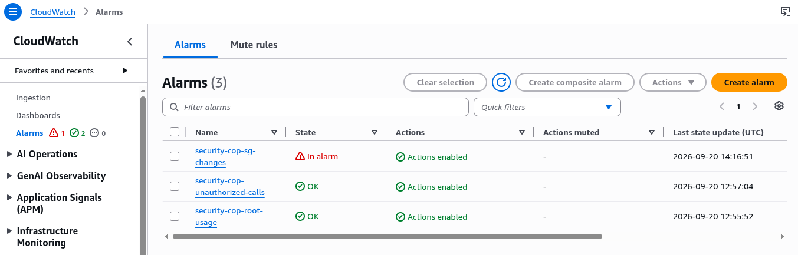
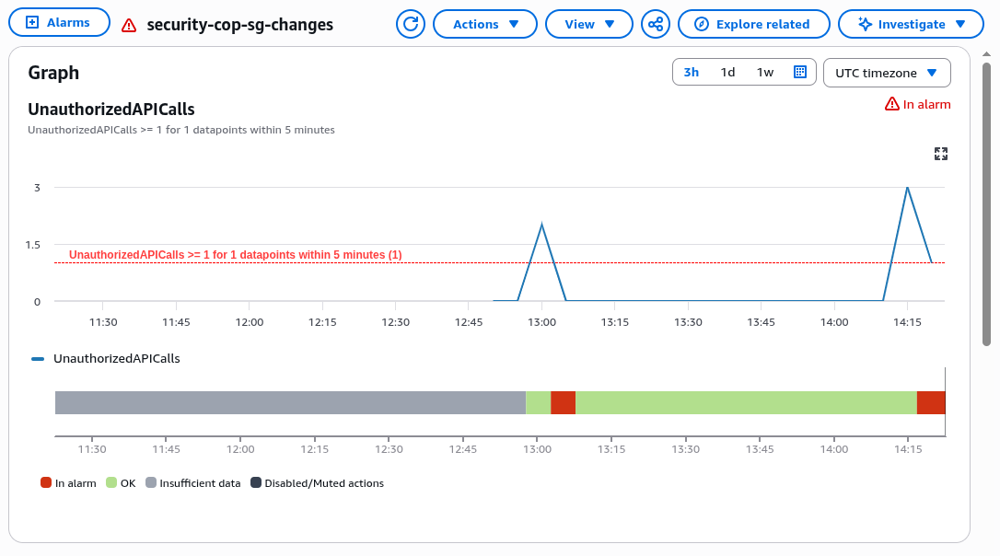
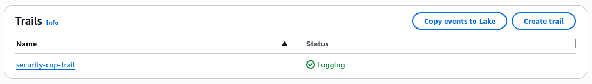
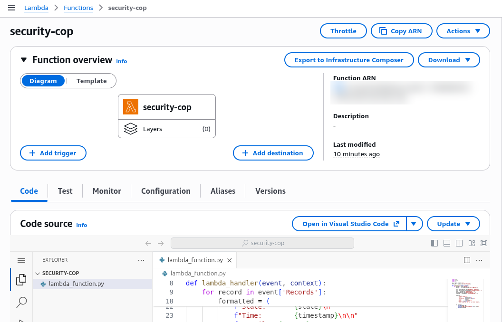
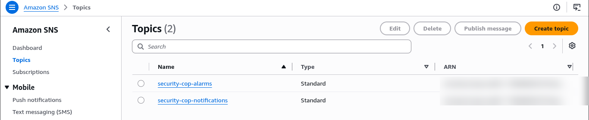
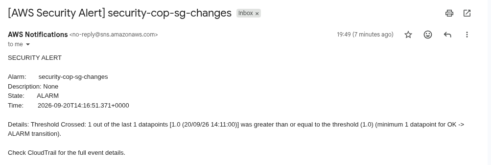
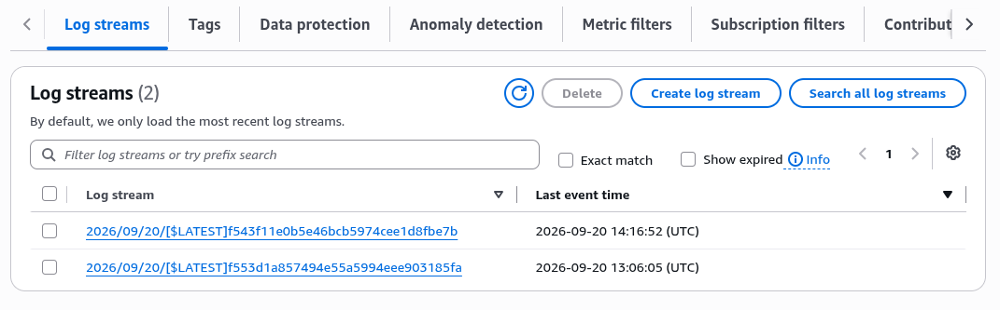

# Project 5 - Automated Security Cop (CloudTrail + CloudWatch + Lambda + SNS)

## What This Project Does

Monitors your AWS account for suspicious activity and sends you an email alert automatically. Every API call in the account is logged by CloudTrail, CloudWatch metric filters scan those logs for dangerous patterns, and when a match is found an alarm triggers Lambda which formats and delivers an alert to your inbox.

---

## Architecture

```
Any API call made in AWS account
    |
    | CloudTrail records it
    v
S3 Bucket (security-cop-trail-1)
    |   Logs stored, encrypted with AWS managed KMS key (SSE-KMS)
    |   Lifecycle: deleted after 90 days
    |
    | CloudTrail also streams to
    v
CloudWatch Log Group (/aws/cloudtrail/security-cop)
    |
    | Metric Filters scan every log line
    |
    |-- Filter 1: Root account usage
    |       pattern: userIdentity.type = "Root"
    |
    |-- Filter 2: Unauthorized API calls (AccessDenied)
    |       pattern: errorCode = "AccessDenied"
    |
    |-- Filter 3: Security group rule changes
    |       pattern: AuthorizeSecurityGroupIngress / Revoke...
    |
    v
CloudWatch Alarms (one per filter)
    |   Threshold crossed → state changes to IN ALARM
    |
    v
SNS Topic: security-cop-alarms
    |   Lambda subscribed here
    |
    v
Lambda Function: security-cop
    |   Parses raw alarm JSON
    |   Formats into readable message
    |
    v
SNS Topic: security-cop-notifications
    |   Your email subscribed here
    |
    v
You receive email: [AWS Security Alert] security-cop-sg-changes
```

---

## Key AWS Services Used

| Service | Purpose |
|---------|---------|
| CloudTrail | Records every API call made in the AWS account |
| S3 | Stores CloudTrail logs (encrypted, auto-deleted after 90 days) |
| KMS | AWS managed key encrypts the S3 log files (SSE-KMS, free) |
| CloudWatch Logs | Receives CloudTrail log stream for real-time monitoring |
| CloudWatch Metric Filters | Scans log lines for specific API call patterns |
| CloudWatch Alarms | Fires when a metric filter pattern count crosses the threshold |
| SNS | Two topics: one for alarms to trigger Lambda, one for email delivery |
| Lambda | Formats the raw alarm JSON into a readable email message |
| IAM | Lambda execution role with SNS publish permission |

---

## Screenshots

<p align="center">
  <br/>
  <em>All 3 security alarms created, sg-changes triggered during testing</em>
</p>

<p align="center">
  <br/>
  <em>UnauthorizedAPICalls metric crossed threshold, alarm fired</em>
</p>

<p align="center">
  <br/>
  <em>security-cop-trail logging all management events</em>
</p>

<p align="center">
  <br/>
  <em>security-cop Lambda parses alarm and publishes to SNS</em>
</p>

<p align="center">
  <br/>
  <em>Two SNS topics: alarms (Lambda subscribed) and notifications (email subscribed)</em>
</p>

<p align="center">
  <br/>
  <em>Email received when security group rule was changed, full flow confirmed working</em>
</p>

<p align="center">
  <br/>
  <em>Log streams showing CloudTrail events arriving in real time</em>
</p>

---

## How It Was Built

### Step 1 - SNS Topics
- Created `security-cop-notifications` (email subscription, confirmed via email link)
- Created `security-cop-alarms` (Lambda subscribes here)

### Step 2 - Lambda Function
- Runtime: Python 3.12
- Reads `SNS_TOPIC_ARN` env var (set to notifications topic ARN)
- Parses incoming CloudWatch alarm JSON, formats readable message, publishes to SNS

### Step 3 - Subscribe Lambda to Alarm Topic
- SNS > `security-cop-alarms` > Create subscription > Protocol: Lambda > select `security-cop`

### Step 4 - S3 Bucket
- Name: `security-cop-trail-1`
- Block Public Access: ON
- Default encryption: SSE-KMS with AWS managed key (`aws/s3`)

### Step 5 - CloudTrail
- Trail name: `security-cop-trail`
- Logs to existing S3 bucket
- CloudWatch Logs enabled, log group `/aws/cloudtrail/security-cop`

### Step 6 - CloudWatch Metric Filters (3 filters)
Applied on log group `/aws/cloudtrail/security-cop`:

| Filter | Pattern | Metric |
|--------|---------|--------|
| Root usage | `{ $.userIdentity.type = "Root" && $.userIdentity.invokedBy NOT EXISTS }` | RootAccountUsage |
| Unauthorized calls | `{ ($.errorCode = "AccessDenied") \|\| ($.errorCode = "UnauthorizedAccess") }` | UnauthorizedAPICalls |
| SG changes | `{ ($.eventName = AuthorizeSecurityGroupIngress) \|\| ($.eventName = RevokeSecurityGroupIngress) \|\| ... }` | SecurityGroupChanges |

### Step 7 - CloudWatch Alarms (3 alarms)
- One alarm per metric filter
- Alarm action: publish to `security-cop-alarms` SNS topic

### Step 8 - Tested
- Added an inbound rule to an existing security group
- CloudTrail logged the `AuthorizeSecurityGroupIngress` API call
- Metric filter matched, SecurityGroupChanges metric incremented
- Alarm fired, Lambda triggered, email received within 2 minutes

---

## Files

```
05-security-cop/
├── app/
│   └── lambda_function.py      # parses CloudWatch alarm JSON, sends formatted email via SNS
├── cloudformation/
│   └── template.yaml           # full infrastructure as code
└── screenshots/
    ├── 01-cloudwatch-alarms-all-three.png
    ├── 02-cloudwatch-alarm-graph-sg-changes.png
    ├── 03-cloudtrail-trail-logging.png
    ├── 04-lambda-function-code.png
    ├── 05-sns-topics.png
    ├── 06-email-security-alert.png
    └── 07-cloudwatch-log-streams.png
```

---

## Key Concepts Demonstrated

**CloudTrail as audit log** - every API call (console click, CLI command, SDK call) is recorded with who, what, when, and from where. Without CloudTrail there is no visibility into account activity.

**Metric filters** - act like search queries running continuously on CloudTrail log lines. When a pattern matches, a counter increments. The alarm watches that counter.

**Two SNS topics** - `security-cop-alarms` decouples the alarm trigger from the email delivery. Lambda sits in between to format the raw JSON into a human-readable message before it reaches your inbox.

**SSE-KMS encryption** - CloudTrail log files stored in S3 are encrypted at rest using the AWS managed KMS key (`aws/s3`). Free, no configuration needed, just selected during bucket creation.

**Event-driven** - no polling, no scheduled jobs. The entire flow is triggered by the API call itself. CloudTrail, CloudWatch, Alarm, SNS, Lambda, SNS, Email, all within 2 minutes of the event.

---

## Alternatives

> **AWS Config** - instead of writing custom metric filters, AWS Config provides managed compliance rules (e.g. `restricted-ssh`, `s3-bucket-public-read-prohibited`). It continuously evaluates resources against rules and flags non-compliant ones. Better for compliance reporting; CloudWatch metric filters are better for real-time event alerting.

> **KMS Customer Managed Key (CMK)** - instead of AWS managed key, create your own KMS key for full control over key rotation schedule, access policy, and audit trail of who used the key. Costs $1/month per key.

> **EventBridge** - instead of CloudWatch metric filters and alarms, use EventBridge rules to match specific CloudTrail events and route them directly to Lambda. More flexible pattern matching, easier to write rules, supports cross-account event routing.

---

## Deploy with CloudFormation

```bash
aws cloudformation create-stack \
  --stack-name project5-security-cop \
  --template-body file://cloudformation/template.yaml \
  --capabilities CAPABILITY_NAMED_IAM \
  --parameters \
    ParameterKey=NotificationEmail,ParameterValue=your@email.com \
  --profile personal
```

> After deploying, check your email and confirm the SNS subscription before any alerts can be delivered.
