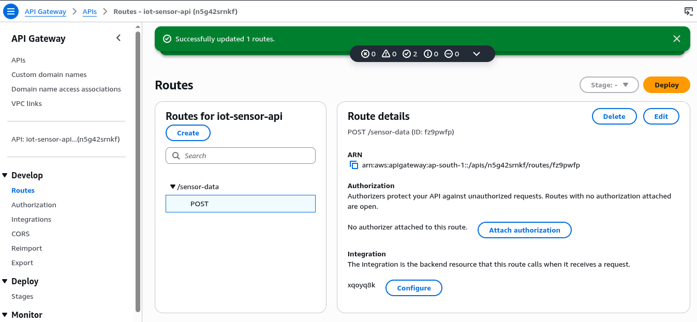
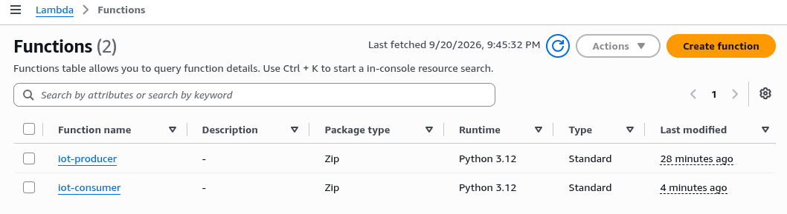
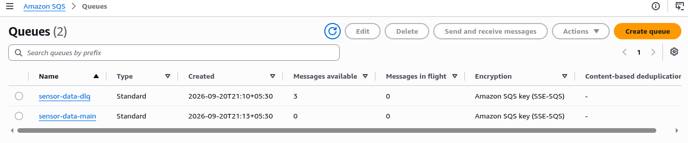
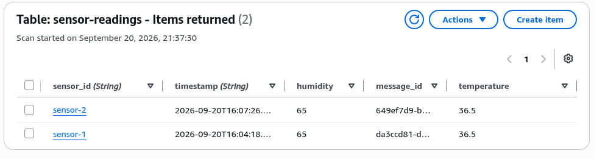
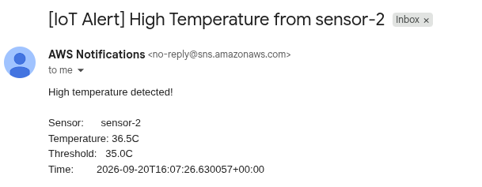
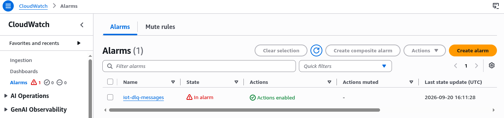
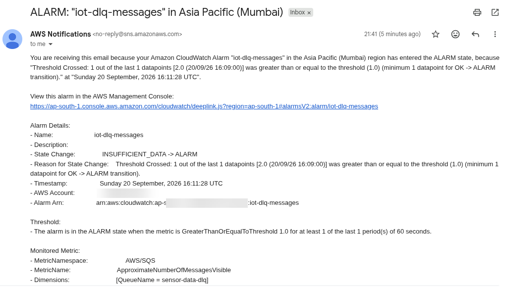

# Project 6 - Event-Driven IoT Sensor Pipeline (API Gateway + SQS + Lambda + DynamoDB + SNS)

## What This Project Does

Simulates an IoT data ingestion pipeline. Sensor readings are posted to an HTTP API, queued for reliable processing, stored permanently in a NoSQL database, and an alert email is sent if temperature crosses a threshold. Failed messages automatically move to a dead letter queue, which triggers a CloudWatch alarm.

---

## Architecture

```
curl POST /sensor-data
    |
    v
API Gateway (HTTP API)
    |   Routes POST /sensor-data to producer Lambda
    |
    v
Lambda: iot-producer
    |   Validates required fields (sensor_id, temperature)
    |   Adds timestamp and message_id
    |
    v
SQS: sensor-data-main
    |   Buffers messages, decouples producer from consumer
    |   Failed messages retried 3 times, then moved to DLQ
    |
    v
Lambda: iot-consumer (triggered by SQS)
    |
    |-- DynamoDB: sensor-readings
    |       Stores all sensor readings (PK: sensor_id, SK: timestamp)
    |
    |-- SNS: sensor-alerts (if temperature > 35C)
            Email alert sent to subscribed address

SQS: sensor-data-dlq
    |   Receives messages that failed 3 consumer attempts
    |
    v
CloudWatch Alarm: iot-dlq-messages
    |   Fires when DLQ has >= 1 message
    |
    v
SNS: sensor-alerts
    Email alert: consumer Lambda is failing
```

---

## Key AWS Services Used

| Service | Purpose |
|---------|---------|
| API Gateway (HTTP API) | Public HTTP endpoint that receives POST requests from sensors |
| Lambda (iot-producer) | Validates sensor payload and pushes to SQS |
| SQS (sensor-data-main) | Buffers messages between producer and consumer |
| SQS (sensor-data-dlq) | Dead letter queue for messages that failed 3 processing attempts |
| Lambda (iot-consumer) | Triggered by SQS, writes to DynamoDB, sends SNS alert if temp high |
| DynamoDB | NoSQL table storing all sensor readings (on-demand billing) |
| SNS | Sends email alerts for high temperature and DLQ failures |
| CloudWatch Alarm | Monitors DLQ depth, fires when messages pile up |
| IAM | Separate roles for producer and consumer with least-privilege permissions |

---

## Screenshots

<p align="center">
  <br/>
  <em>API Gateway HTTP API with POST /sensor-data route wired to producer Lambda</em>
</p>

<p align="center">
  <br/>
  <em>Both Lambda functions: iot-producer and iot-consumer</em>
</p>

<p align="center">
  <br/>
  <em>Main queue and DLQ - DLQ shows 3 messages from the failed consumer test</em>
</p>

<p align="center">
  <br/>
  <em>DynamoDB sensor-readings table with items stored by consumer Lambda</em>
</p>

<p align="center">
  <br/>
  <em>Email alert when sensor-2 reported temperature 36.5C, above the 35C threshold</em>
</p>

<p align="center">
  <br/>
  <em>CloudWatch alarm fired when failed messages landed in the DLQ</em>
</p>

<p align="center">
  <br/>
  <em>Email received from CloudWatch alarm confirming DLQ has messages and consumer is failing</em>
</p>

---

## How It Was Built

### Step 1 - SQS Queues
- Created `sensor-data-dlq` (standard queue, 14 day retention)
- Created `sensor-data-main` (standard queue, redrive policy: DLQ after 3 failures, visibility timeout 30s)

### Step 2 - DynamoDB Table
- Table name: `sensor-readings`
- Partition key: `sensor_id` (String), Sort key: `timestamp` (String)
- Billing mode: On-demand (pay per request, no provisioned capacity)

### Step 3 - SNS Topic
- Topic: `sensor-alerts`, email subscription confirmed

### Step 4 - Producer Lambda
- Runtime: Python 3.12, env var: `QUEUE_URL`
- Validates `sensor_id` and `temperature` fields, adds `timestamp` and `message_id`, pushes to SQS

### Step 5 - Consumer Lambda
- Runtime: Python 3.12, env vars: `TABLE_NAME`, `SNS_TOPIC_ARN`, `TEMP_THRESHOLD=35`
- Triggered by SQS (batch size 1), writes to DynamoDB, publishes SNS alert if temp > threshold

### Step 6 - API Gateway
- HTTP API type, POST /sensor-data route, Lambda proxy integration with iot-producer
- $default stage with auto-deploy enabled

### Step 7 - CloudWatch Alarm
- Metric: `ApproximateNumberOfMessagesVisible` on `sensor-data-dlq`
- Threshold: >= 1 message triggers alarm, action: publish to `sensor-alerts` SNS

### Step 8 - Tested
- Normal flow: `curl -X POST <api-url>/sensor-data -d '{"sensor_id":"sensor-1","temperature":36.5,"humidity":65}'`
  - Item appeared in DynamoDB, high-temp email received
- DLQ flow: broke consumer Lambda (wrong TABLE_NAME env var), sent another message
  - Consumer failed 3 times, message moved to DLQ, CloudWatch alarm fired, DLQ alarm email received

---

## Files

```
06-iot-sensor-pipeline/
├── app/
│   ├── producer/
│   │   └── lambda_function.py      # validates payload, pushes to SQS
│   └── consumer/
│       └── lambda_function.py      # reads SQS, writes DynamoDB, SNS alert
├── cloudformation/
│   └── template.yaml               # full infrastructure as code
└── screenshots/
    ├── 01-dynamodb-sensor-readings.png
    ├── 02-sqs-queues.png
    ├── 03-api-gateway-routes.png
    ├── 04-lambda-functions.png
    ├── 05-cloudwatch-dlq-alarm.png
    ├── 06-email-high-temp-alert.png
    └── 07-email-dlq-alarm-alert.png
```

---

## Key Concepts Demonstrated

**SQS decoupling** - the producer Lambda does not call the consumer directly. It writes to SQS and returns immediately. If the consumer is down or slow, messages wait in the queue. Producer and consumer scale independently.

**Dead letter queue** - SQS automatically moves a message to the DLQ after 3 failed processing attempts (configurable via `maxReceiveCount`). This prevents a bad message from blocking the queue forever and makes failures visible.

**DynamoDB on-demand** - no capacity planning needed. The table charges per read/write request. For a portfolio project or low-volume workload this costs effectively nothing.

**Visibility timeout** - when SQS delivers a message to the consumer Lambda, it hides the message from other consumers for 30 seconds. If Lambda finishes and deletes the message, it is gone. If Lambda crashes, the message reappears after 30 seconds for retry. This is how SQS achieves at-least-once delivery.

**Event-driven** - no polling loop. SQS triggers Lambda automatically when messages arrive. CloudWatch triggers SNS when the DLQ alarm fires. The whole pipeline reacts to events without any scheduled jobs.

---

## Alternatives

> **Kinesis Data Streams** - instead of SQS, Kinesis provides ordered, replayable event streaming. Better when you need strict ordering or want to replay historical data. SQS is simpler and cheaper for standard queuing use cases.

> **DynamoDB Streams** - instead of publishing SNS from Lambda directly, DynamoDB Streams can trigger a separate Lambda whenever a new item is written. Better when multiple consumers need to react to data changes independently.

> **EventBridge Pipes** - connects SQS directly to DynamoDB or other targets without writing Lambda code for the routing logic. Useful when the transformation is simple and you want less code to maintain.

---

## Deploy with CloudFormation

```bash
aws cloudformation create-stack \
  --stack-name project6-iot-pipeline \
  --template-body file://cloudformation/template.yaml \
  --capabilities CAPABILITY_NAMED_IAM \
  --parameters \
    ParameterKey=AlertEmail,ParameterValue=your@email.com \
  --profile personal
```

> After deploying, confirm the SNS email subscription before sending test sensor data.
